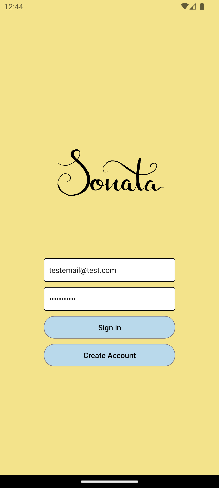
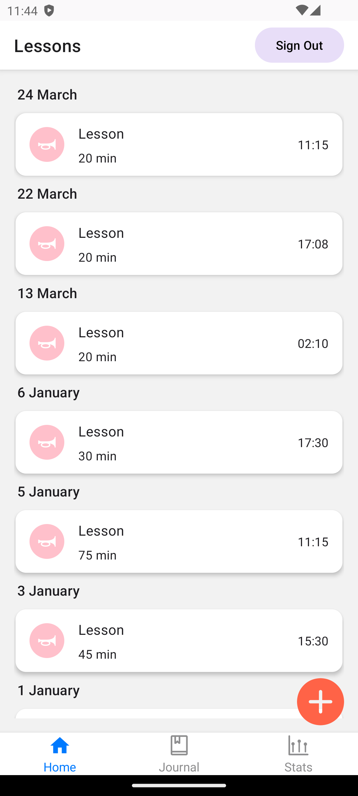
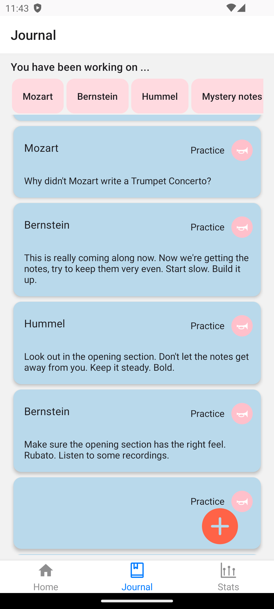
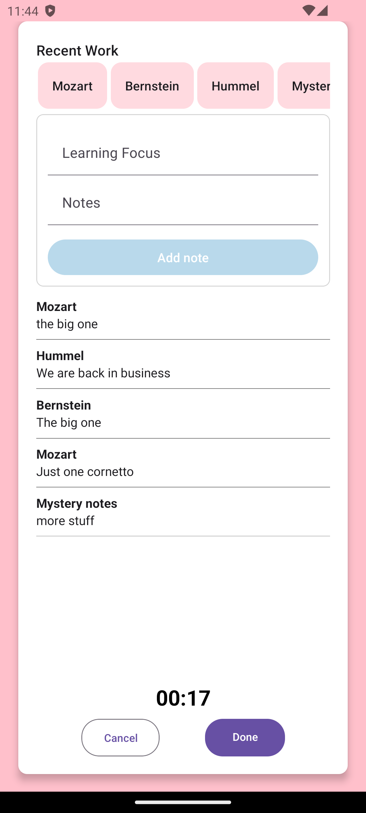
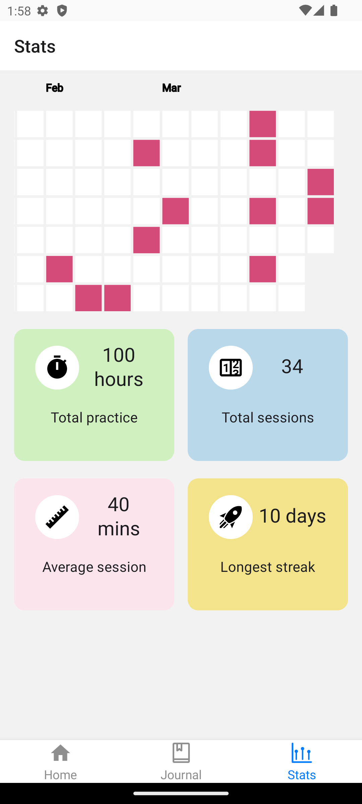

# Sonata

I've been building an app in React Native that helps music students to organise their practice. They are able to link their work to their lessons by looking at recent notes from lessons and practices and browse by the learning focus of that session. So a particular piece or area of technique.

Statistics are displayed on stats Tab.

I am planning to expand the features of the app to include friends where musicians can compare their stats and commuicate with each other. I will add a table to the database where repertoire data is stored and other users will be able to see what pieces they have been working on.

<strong>Login Screen</strong>

 

<strong>Lessons Screen</strong>

 

<strong>Journal Screen</strong>

 

<strong>Practice Modal</strong>

Recent learning focus topics can be selected from the horizontal scroller at the top of the screen

 

 

<strong>Stats Screen</strong>

